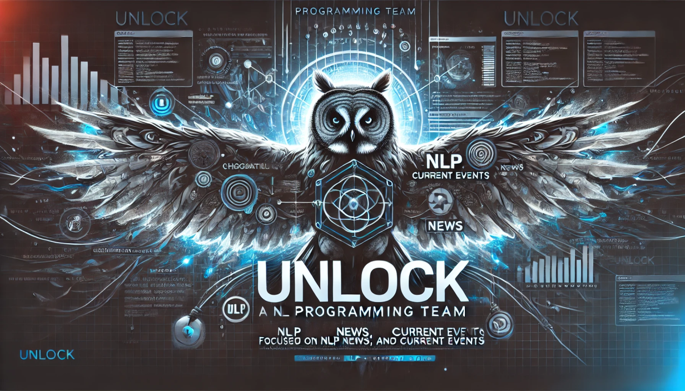

# Factored Datathon 2024 UNlock 🚀📊

Welcome to the Factored Datathon 2024 UNlock! 🎉 Join our team of passionate data enthusiasts as we explore innovative ways to prevent risks and find solutions before they become problems. 📈💡

## Team Members 👥

Meet the brilliant minds behind this project:

- Daniel Melo 🧠
- Eduards Mendez 📊
- Juan Pablo Mendez 🚀
- Cristhian Pardo 💪

## Deployed Solution 🚀

Check out our deployed solution on Streamlit: [Factored Datathon 2024 UNlock](https://factored-datathon-2024-unlock-dqjmbpncbplje8jbkzwzfs.streamlit.app/) 🛍️🔍

## Tech Stack 🛠️

We've utilized cutting-edge technologies to build this data solution:

- Pinecone 🌲
- OpenAI 🤖
- Databricks 🚀
- Streamlit 🎛️
- Amazon Agente 🤖

## File Structure 📂

Our project is organized into the following directories:

- **data-engineering** 🚀
  - This directory contains the scripts and tools used for processing and transforming data, forming the backbone of our data pipeline.
  
- **ml-pipeline-tools** 🤖
  - Here you'll find notebooks and scripts dedicated to machine learning models, data analysis, and other exploratory tasks related to our machine learning pipeline.
  
- **web-scrapping** 🌐
  - This directory houses the code responsible for extracting and gathering data from various web sources, crucial for feeding our data pipeline and ML models.

## Features ✨

## The best 🌟

## Contributing

Feel free to reach out to any of our team members for more information:

- Daniel Melo: 
- Juan Pablo Mendez:
- Eduards Mendez: [LinkedIn](https://www.linkedin.com/in/eduards-alexis-mendez-chipatecua-8584b21b4/)
- Cristhian Pardo: [LinkedIn](https://www.linkedin.com/in/cristhian-pardo/)
  

Let's innovate and make data magic together! 🌟🔮
